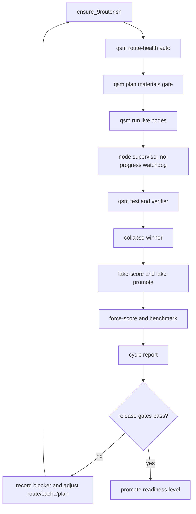

# Quantum Swarm V3 Production-Level Definition And Long-Run Deployment Plan

Date: 2026-05-05

This document defines what "production level" means for Quantum Swarm V3 and lays out the long-run deployment path to reach it. It uses the current live evidence:

- 9Router is live at `http://127.0.0.1:20128/v1`.
- Grok Council is live on port `8338` and was consulted without restarting it.
- `qsm route-health -models auto` now discovers live free/combo routes from `/v1/models`.
- A live 9Router/LangChain run succeeded `2/2` and delivered `deliveries/obj-1777948276`.
- A later one-node `auto` run selected the reliable route but stalled in `cache_refresh`, exposing the next hard product blocker.
- The no-progress watchdog has now been implemented in the swarm executor and covered by tests.
- The auto-QA gate has been made stricter: code products need a real test surface, and static-web products need a passing browser/behavior smoke or manifest equivalent.
- Current force score is around `5.7-5.8/10`, so QSM is not production-level yet.

## Definition: What Counts As Production Level

Production-level QSM means the framework can repeatedly accept a request, plan the materials, run real agent nodes, verify the output, collapse a winner, and preserve useful learning without human rescue during normal operation.

It does not mean enterprise-scale marketing claims on day one. It does mean the product is trustworthy enough that a user can run it for real work and understand every failure.

## Readiness Levels

### Level 0: Prototype

Status: already passed.

Definition:

- CLI exists.
- Rooms can run.
- Products can be delivered.
- Basic tests pass.

Allowed claim:

`prototype only`

### Level 1: Local Alpha

Status: current honest state.

Definition:

- `qsm run`, `qsm status`, `qsm route-health`, `qsm lake-score`, `qsm force-score`, `qsm cost`, `qsm sandbox`, and `qsm benchmark` work locally.
- 9Router can be activated and probed.
- At least one live harness path can produce a delivery.
- Failures are recorded instead of hidden.
- Data lake maintenance and strict promotion gates exist.

Allowed claim:

`local alpha / internal developer use`

Hard gaps:

- no-progress harness stalls are now detected and retried, but still need long-run live evidence.
- lake citation coverage is not enforced.
- hard sandbox execution is not enforced.
- 24/7 evidence is not collected.

### Level 2: Local Beta

Target: first serious product milestone.

Definition:

- 9Router-first route selection is stable under repeated runs.
- Stuck nodes are killed, retried, and recorded automatically.
- Every live run has complete node accounting.
- Every node reads lake/cache and cites consumed memory IDs.
- The system can run at least `25` consecutive cycles without manual repair.
- Local benchmark suite passes after each change.

Allowed claim:

`local beta / useful autonomous build service for controlled tasks`

Hard gates:

- `go test ./...` passes.
- `qsm route-health -models auto` finds at least `1` healthy route.
- `qsm benchmark -suite local-smoke` passes.
- `qsm lake-score` shows:
  - refresh coverage `>= 90%`
  - write coverage `>= 90%`
  - cache/wiki citation coverage `>= 70%`
- no stale `running` room statuses after a cycle.
- no node may exceed no-progress timeout without retry/fail evidence.

### Level 3: Production Candidate

Target: usable product release.

Definition:

- Long-run harness is stable for repeated mixed tasks.
- Route circuit-breaker prevents known-bad providers from burning cycles.
- DeepSeek direct fallback is used only when 9Router has no healthy route and the fallback is explicitly enabled.
- Cost/token accounting is captured per node and per objective.
- Docker or microVM hard sandbox profile exists and is used for production profile.
- Benchmark and reliability reports are generated automatically.

Allowed claim:

`production candidate for single-machine local use`

Hard gates:

- `100` consecutive autorun cycles, with:
  - `>= 90%` cycle completion
  - `>= 95%` all-nodes-accounted
  - `0` orphaned harness processes
  - `0` stale `running` rooms after cleanup
  - `>= 80%` lake citation coverage
- `5` consecutive 3-node live runs pass.
- `3` consecutive 7-node local-capacity runs pass or degrade gracefully.
- force score `>= 8.0/10`, no category below `6`.
- sandbox report says hard sandbox is ready for the chosen production profile.

### Level 4: Enterprise Production

Target: future, not current local product.

Definition:

- Multi-user operation.
- dashboard/exporter/tracing.
- CI/CD or supervised service install.
- official benchmark adapters.
- SBOM/license/compliance automation.
- high-concurrency evidence.

Allowed claim:

`enterprise-ready`

Hard gates:

- force score `>= 9.0/10`, no category below `7`.
- official or official-shaped benchmark evidence.
- documented recovery and disaster procedures.
- security/compliance reports.

## Production Invariants

These rules must always hold before QSM can claim production candidate:

1. No fake success.
   A delivery is approved only when product verification, tests, evidence, and collapse all agree.

1a. No testless code products.
   Go, Python, and Node products must include dedicated test files or an explicit manifest test command, plus at least one passing test command.

1b. No inert static web apps.
   Static-web products must pass JavaScript/static checks and a browser/behavior smoke command before QA approval.

2. No silent stalls.
   A node stuck in one phase without status updates must be killed, retried, or failed with evidence.

3. No stale route trust.
   A route is trusted only when fresh route-health and build-health support it.

4. No write-only memory.
   Nodes must consume and cite lake/cache/wiki items, not only write new cache entries.

5. No unbounded spend.
   Every route and node must have token/cost estimates or provider-reported usage.

6. No production without sandbox policy.
   Local room isolation is acceptable for alpha; production requires Docker or microVM enforcement.

7. No unverified material.
   Phase A must verify critical tools, model routes, dependencies, tests, and acceptance criteria before Chop.

## Long-Run Deployment Architecture



## Deployment Profiles

### Profile A: Alpha Live Test

Purpose: prove real routes and harness still work today.

Settings:

- positions: `1-2`
- parallel: `1-2`
- harness: `langchain`
- route-health: `auto`
- sandbox: `room-only`
- fallback: disabled unless explicitly needed

Command shape:

```bash
./scripts/ensure_9router.sh
./qsm route-health -root . -harness langchain -models auto -limit 16 -timeout 30s
./qsm run -root . \
  -request "Alpha live product smoke" \
  -harness langchain \
  -positions 2 \
  -parallel 2 \
  -retries 1 \
  -shared-cache=true \
  -route-health=true \
  -route-health-models=auto \
  -route-health-limit=16
./qsm lake-score -root .
./qsm force-score -root .
```

Pass:

- at least `1` node succeeds.
- no orphan process remains.
- delivery exists if collapse approves.

### Profile B: Local Beta Soak

Purpose: prove repeated autonomous operation.

Settings:

- cycles: `25`
- interval: `2-5m`
- positions: `3`
- parallel: `2`
- retries: `1-2`
- route-health: `auto`
- route circuit-breaker: required
- no-progress watchdog: required

Command shape after watchdog is implemented:

```bash
./qsm autorun -root . \
  -request "Local beta long-run product build cycle" \
  -harness langchain \
  -positions 3 \
  -parallel 2 \
  -max-cycles 25 \
  -interval 2m \
  -retries 2 \
  -shared-cache=true \
  -route-health=true \
  -deepseek-fallback=false
```

Pass:

- `>= 90%` cycle completion.
- `>= 95%` all-nodes-accounted.
- `0` stale running rooms.
- `0` orphaned `qsm run` or `langchain_runner.py` processes.
- `lake-score` citation coverage reaches `>= 70%`.

### Profile C: Production Candidate Soak

Purpose: prove single-machine product reliability.

Settings:

- cycles: `100`
- positions: `3-7`, capacity-planned
- parallel: `auto`, capped by hardware and cost
- sandbox: `docker` or `microvm`
- fallback: 9Router first, direct DeepSeek only if route-health finds no healthy 9Router route
- benchmark: local benchmark every `10` cycles

Command shape:

```bash
./qsm autorun -root . \
  -request "Production candidate long-run autonomous build cycle" \
  -harness langchain \
  -positions auto \
  -parallel auto \
  -max-cycles 100 \
  -interval 5m \
  -retries 2 \
  -shared-cache=true \
  -route-health=true \
  -deepseek-fallback=true
```

Pass:

- `>= 90%` cycles succeed.
- average force score `>= 8.0`.
- lake citation coverage `>= 80%`.
- no critical/high security findings.
- no hard sandbox escape in probe.
- cost report exists for every cycle.

## Implementation Plan To Reach Local Beta

### Step 1: Harness No-Progress Watchdog

Status: implemented in `internal/swarm/executor.go`.

Problem:

The latest `auto` smoke selected the intended reliable model, then stalled in `cache_refresh`. Manual termination was required.

Build:

- Add `QSM_NODE_NO_PROGRESS_TIMEOUT` default, for example `120s`.
- Supervisor polls room status while harness executes.
- If `phase`, `updated_at`, and product/evidence state do not change within the timeout:
  - terminate child process;
  - mark room failed with `no_progress_timeout`;
  - write failed-attempt cache item;
  - retry if attempts remain;
  - try next healthy route when available.

Acceptance:

- A fake harness that never updates status is killed and marked failed.
- No stale `running` status after timeout.
- Build-health records the timeout failure.

Implemented evidence:

- `QSM_NODE_NO_PROGRESS_TIMEOUT` controls the watchdog timeout, defaulting to `120s`.
- A per-attempt cancellable context is passed into the harness.
- The watchdog reads `.qsm_status/status.json` and cancels the harness when `updated_at` stops moving past the timeout.
- `no_progress_timeout` is treated as retryable.
- Failed attempts are written into the lake as `failed_attempt`.
- Test: `TestExecutorNoProgressWatchdogRetriesSilentNode`.
- Verification: `go test ./...` passes.

### Step 2: Route Circuit Breaker

Problem:

Some routes are technically live but flaky or produce empty content.

Build:

- Track route failure reason counts:
  - `http_error`
  - `empty_content`
  - `reasoning_only`
  - `timeout`
  - `step_budget`
  - `no_progress`
- Add TTL blacklist:
  - 3 failures within 30 minutes => skip for 15 minutes.
  - repeated model-not-found/deprecated => skip for 24 hours.
- Score route selection by:
  - fresh route-health OK;
  - build-health success rate;
  - last error;
  - latency;
  - cost per success.

Acceptance:

- `wombo`-style flaky failures lose priority automatically.
- deprecated `ling-2.6-flash-free` does not keep being selected.
- `qsm status` shows skipped routes and reasons.

### Step 2a: Aggressive Auto-QA Gate

Status: implemented in `internal/tester/tester.go`.

Problem:

The previous QA layer could accept weak products when they were non-empty and had no explicit tests. That is not production-grade.

Build:

- Generic/document deliverables may still pass without executable tests.
- Go/Python/Node products now require:
  - dedicated test files or a manifest test command;
  - at least one passing test command.
- Static-web products now require:
  - passing JavaScript/static checks when JavaScript is present;
  - a passing browser/behavior smoke command, either QSM Playwright smoke or an explicit manifest command.
- Command reports now include `origin`, so QSM can distinguish built-in checks from manifest-provided QA.
- Simulated and fallback snake fixtures now include:
  - `test_manifest.json`;
  - `qa_static_smoke.cjs`.

Acceptance:

- `TestVerifyRejectsCodeProductWithoutTests` proves code products without tests fail.
- `TestVerifyAcceptsManifestTestForCodeProduct` proves explicit manifest QA can satisfy the gate.
- `TestSimulatedHarnessBuildsSnakeGame` proves generated static web fixtures ship with runnable QA evidence.
- `go test ./...` passes.
- `qsm benchmark -suite local-smoke` passes under the stricter gate.

### Step 3: Lake Citation Enforcement

Problem:

The lake is a memory system, but node outputs still show poor explicit citation coverage.

Build:

- Add required evidence fields:
  - `cache_item_ids_observed`
  - `cache_item_ids_used`
  - `wiki_artifact_ids_used`
  - `citation_coverage`
- Node prompt must say:
  - read `.qsm_memory/CACHE.md` first;
  - cite IDs used for factual or technical decisions;
  - if no memory applies, write `no_applicable_memory`.
- Collapse penalizes or rejects zero-citation evidence for non-trivial tasks.

Acceptance:

- `qsm lake-score` citation coverage `>= 70%`.
- promoted recipes include provenance.
- low-signal operational cache entries remain rejected.

### Step 4: Long-Run Report Command

Problem:

Autorun can run cycles, but production needs a single report that explains reliability.

Build:

Add:

```bash
qsm long-run-report -root . -since 24h
```

Report:

- cycles started/completed/failed.
- node success rate.
- stale room count.
- orphan process count.
- route failure matrix.
- cost per success.
- lake refresh/write/citation trends.
- force-score trend.
- benchmark trend.
- go/no-go verdict.

Acceptance:

- One Markdown and one JSON report in `.state/`.
- Release gate can read it.

### Step 5: Production Profile Gate

Build:

Add:

```bash
qsm release-gate -root . -profile local-beta
qsm release-gate -root . -profile production-candidate
```

Gate evaluates:

- route-health freshness.
- long-run report.
- force-score.
- lake-score.
- benchmark.
- sandbox.
- cost.
- stale status/orphan process check.

Acceptance:

- QSM can print:
  - `GO local-beta`
  - `NO-GO production-candidate: blockers [...]`

## Long-Run Operating Loop

Every cycle should run this sequence:

```bash
./scripts/ensure_9router.sh
./qsm route-health -root . -harness langchain -models auto -limit 16 -timeout 30s
./qsm lake-maintain -root . -apply=true
./qsm lake-promote -root . -apply=true
./qsm run -root . \
  -request "$QSM_REQUEST" \
  -harness langchain \
  -positions "$QSM_POSITIONS" \
  -parallel "$QSM_PARALLEL" \
  -retries 2 \
  -shared-cache=true \
  -route-health=true \
  -route-health-models=auto \
  -route-health-limit=16
./qsm lake-score -root .
./qsm cost -root .
./qsm force-score -root .
./qsm benchmark -root . -suite local-smoke
```

Do not run this as a 24/7 service until the no-progress watchdog exists.

## Deployment Gate Matrix

| Gate | Local Alpha | Local Beta | Production Candidate |
| --- | ---: | ---: | ---: |
| `go test ./...` | required | required | required |
| 9Router live | required for live tests | required | required |
| route-health healthy routes | `>= 1` | `>= 1` | `>= 2` or approved fallback |
| no-progress watchdog | recommended | required | required |
| route circuit-breaker | recommended | required | required |
| lake citation coverage | measured | `>= 70%` | `>= 80%` |
| long-run cycles | ad hoc | `25` | `100` |
| cycle success | measured | `>= 90%` | `>= 90%` |
| stale running rooms | allowed only if manual test interrupted | `0` | `0` |
| orphan processes | `0` after cleanup | `0` | `0` |
| sandbox | room-only ok | docker-ready preferred | docker/microVM enforced |
| force score | measured | `>= 7.0` | `>= 8.0` |
| official benchmarks | not required | not required | adapter planned |

## Current Next Action

The next implementation should be:

1. Add route circuit-breaker TTL.
2. Add lake citation enforcement.
3. Add `long-run-report`.
4. Run a supervised `25`-cycle Local Beta soak with `QSM_NODE_NO_PROGRESS_TIMEOUT=120s`.
5. Run `release-gate -profile local-beta`.

Unattended long-run deployment is now possible only as a controlled soak test, not as a user-facing product service. The watchdog prevents silent stalls from hanging forever, but we still need repeated live evidence before calling this Local Beta.
