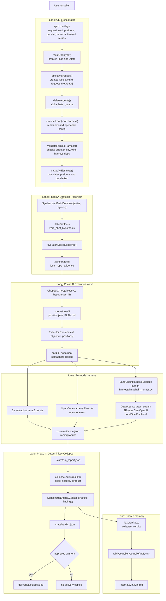
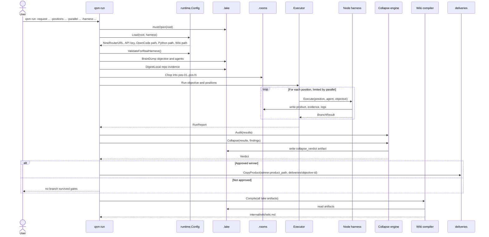
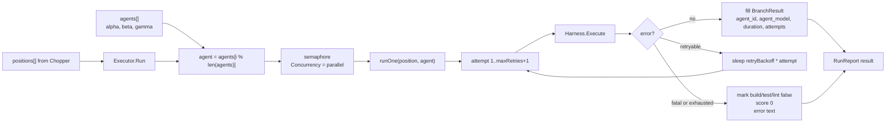

# Quantum Swarm Team Workflow Graph

Generated from the current project folder:

`/Users/nexus/Downloads/NemoClaw/go_claw/quantum-swarm-v3-scratch`

This describes the actual implemented flow in this repo, not only the V3 concept.

## High-Level Lane Graph



## Sequence Flow



## Node Execution Lane



## Folder and File I/O Map

| Path | Read | Written | Purpose |
|---|---:|---:|---|
| `cmd/qsm/main.go` | yes | no | CLI entrypoint and orchestration flow. |
| `internal/runtime/config.go` | yes | no | Loads env, 9Router URL/key, OpenCode config, Python runner paths. |
| `/Users/nexus/Downloads/NemoClaw/cli_proxy_api/opencode.json` | yes | no | Source of provider base URLs and API keys when env is not set. |
| `.lake/artifacts/*.json` | yes | yes | Data lake artifacts from synthesis, hydration, optional council, collapse. |
| `internal/wiki/wiki.md` | yes | yes | Compiled memory from lake artifacts. Real harness validation requires it. |
| `.rooms/pos-N/position.json` | yes | yes | Room-local branch contract. |
| `.rooms/pos-N/PLAN.md` | yes | yes | Room-local plan for the branch. |
| `.rooms/pos-N/product/*` | yes | yes | Node deliverable. Required for approval. |
| `.rooms/pos-N/evidence.json` | yes | yes | Node proof: build, test, lint, score, product path. |
| `.rooms/pos-N/*.log` | yes | yes | Harness stdout, stderr, events. |
| `.state/run_report.json` | yes | yes | Full node accounting: requested, started, succeeded, failed, results. |
| `.state/verdict.json` | yes | yes | Collapse winner, approval, ranked branches, audit findings. |
| `deliveries/objective-id/*` | no | yes | Final copied product from the approved winning room. |

## Lake Memory and Shared Cache Design

The intended lake is not just an audit log. It is the shared construction yard for the swarm.

Conceptually, `.lake` should combine four kinds of material before and during build:

1. **Agent inner knowledge**
   Phase 1 captures each agent's zero-shot reasoning before tool output biases it. This is the closest available representation of the agent's pretrained knowledge, taste, assumptions, architecture sketch, and implementation instinct.

2. **Research and study**
   Phase 2 hydrates the lake with grounded material: local repo archaeology, docs, web research, API notes, dependency behavior, prior run reports, and verified findings.

3. **Parallel construction plans**
   Phase 3 turns the lake into multiple positions: plans, sketches, branch strategies, test expectations, and room-local execution context. Each position is like a separate construction crew using the same material library but building a different possible solution.

4. **Cross-node cache**
   During execution, nodes should share useful discoveries through the lake: failed approaches, dependency errors, verifier failures, rate-limit signals, known-good snippets, product constraints, and successful test recipes. This prevents later nodes from stepping on the same mistake repeatedly.

This is similar to a neural network pass at orchestration scale:

```text
input request
  -> agent priors and hypotheses
  -> research hydration
  -> divergent node activations
  -> concrete build attempts
  -> verifier and auditor scoring
  -> deterministic collapse into one output
```

The current implementation writes synthesis, hydration, position, optional council, and collapse artifacts into `.lake/artifacts`. It now also has an opt-in execution cache under `.lake/cache` when `-shared-cache` or `QSM_SHARED_CACHE=1` is enabled.

The implemented first slice supports:

- typed `CacheItem` records in `.lake/cache`
- an executor-seeded objective `constraint` item at the start of shared-cache runs
- room-local `.qsm_memory/CACHE.md`
- executor-published `verified_recipe`, `failed_attempt`, and `rate_limit_signal` lessons
- LangChain runner cache writes for product acceptance and graph failures
- LangChain runner live cache refresh before model calls, injecting current verified cache facts into the DeepAgents system prompt
- status/report cache summaries
- deterministic launch ordering so later queued positions can read earlier verified lessons when `parallel=1`

The current production feature slice now supports **live mid-run cache consumption during larger parallel waves** for the DeepAgents/LangChain harness. When `-shared-cache` or `QSM_SHARED_CACHE=1` is enabled, the runner re-reads `.lake/cache` before model calls, refreshes `.rooms/pos-N/.qsm_memory/CACHE.md`, updates the marked live-cache section inside `.rooms/pos-N/.qsm_memory/AGENTS.md`, and appends the latest verified facts into the model request.

OpenCode nodes still consume the room cache as a startup file. The remaining production work there is an equivalent live prompt/context refresh or a supervisor loop around OpenCode so active OpenCode branches can consume sibling lessons without restarting the process.

The desired next version should support a scoped lake/cache contract:

| Cache Item | Producer | Consumer | Purpose |
|---|---|---|---|
| `failed_attempt` | any node/verifier | sibling nodes | Avoid repeating broken commands, bad paths, missing assets, or invalid API usage. |
| `verified_recipe` | successful node/verifier | sibling nodes and collapse | Reuse known-good build/test steps. |
| `constraint` | hydrator/auditor/user | all nodes | Keep product, security, and environment rules visible. |
| `dependency_note` | node/research | sibling nodes | Share package/runtime behavior and setup quirks. |
| `rate_limit_signal` | executor/harness | scheduler | Slow or rotate models/providers before the whole wave fails. |
| `score_signal` | verifier/auditor | collapse and later nodes | Explain why a branch is improving or failing. |

Important design boundary: shared cache should improve coordination without creating consensus bias too early. Positions should remain isolated for product files, but they may read **verified cache facts** and **negative lessons** from the lake.

## Function I/O Matrix

| Function | Input | Output | Notes |
|---|---|---|---|
| `run(args)` | CLI flags | console summary, state files, delivery | Main pipeline controller. |
| `mustOpen(root)` | workspace root | `*lake.Lake`, `.state` dir | Opens `.lake` and ensures state dir. |
| `objective(request)` | request string | `swarm.Objective` | ID currently uses Unix seconds. |
| `defaultAgents()` | none | `[]swarm.Agent` | Three hardcoded agents: alpha, beta, gamma. |
| `runtime.Load(root, mode)` | root, harness mode, env, opencode config | `runtime.Config` | Discovers 9Router URL/key and harness paths. |
| `ValidateForRealHarness()` | `runtime.Config` | error or nil | Checks real harness prerequisites. |
| `capacity.Estimate()` | local hardware, node profile | recommended nodes and positions | Memory and CPU estimate. Real harness parallel auto caps at 2 if positions > 2. |
| `Synthesizer.BrainDump()` | objective, agents | hypotheses, lake artifacts | Phase 1 zero-shot hypotheses. |
| `Hydrator.DigestLocal()` | repo root | count, lake artifacts | Phase 2 local repo evidence. Skips generated and heavy dirs. |
| `Chopper.Chop()` | objective, hypotheses, N | `[]Position`, rooms | Clears old `pos-*` rooms before creating new rooms. |
| `Executor.Run()` | objective, positions, harness, agents | `RunReport` | Executes all positions with concurrency and accounting. |
| `Executor.runOne()` | one position, one agent | `BranchResult` | Handles retries and normalizes result metadata. |
| `SimulatedHarness.Execute()` | position | product, evidence, `BranchResult` | Deterministic fixture mode. |
| `OpenCodeHarness.Execute()` | position, agent, objective, config | product, evidence, logs | Runs `opencode run --model provider/model`. |
| `LangChainHarness.Execute()` | position, agent, objective, config | product, evidence, logs | Runs `harness/langchain_runner.py` with JSON stdin. |
| `langchain_runner.run_deepagent()` | JSON payload, env | room product and evidence | Uses DeepAgents, LocalShellBackend, ChatOpenAI via 9Router. |
| `run_graph_with_qsm_stop()` | DeepAgents graph, room, prompt | final graph state, stop reason | Streams graph events and stops when product/evidence passes. |
| `make_live_cache_middleware()` | room, DeepAgents middleware APIs | model-call middleware | Refreshes `.lake/cache` and injects verified cache facts into DeepAgents system prompts before each model call. |
| `refresh_live_cache_files()` | room, optional memory file | `.qsm_memory/CACHE.md`, updated AGENTS.md cache section | Keeps live cache material auditable in room-local files. |
| `deterministic_product_check()` | product dir | boolean | Checks non-empty product and local HTML assets. |
| `collapse.Audit()` | branch results | audit findings | Code, security, and product findings per branch. |
| `ConsensusEngine.Collapse()` | results, findings | verdict, lake artifact | Ranks audit-passed branches first, then score. |
| `delivery.CopyProduct()` | winner product path, delivery path | copied files | Removes existing delivery target first. |
| `wiki.Compiler.Compile()` | lake artifacts | `internal/wiki/wiki.md` | Sorts artifacts and writes Markdown memory. |

## Actual Data Contracts

### Objective

```json
{
  "id": "obj-<unix_seconds>",
  "request": "user request",
  "metadata": {
    "spec": "V3.0"
  },
  "created_at": "timestamp"
}
```

### Position

```json
{
  "id": "pos-01",
  "name": "Divergent Position 1",
  "strategy": "agent blueprint or independent strategy",
  "room": ".rooms/pos-01",
  "source_agent": "alpha",
  "tests": ["go test ./...", "domain-specific checks"]
}
```

### BranchResult

```json
{
  "position_id": "pos-01",
  "agent_id": "alpha",
  "agent_model": "oc/ling-2.6-flash-free",
  "room": ".rooms/pos-01",
  "build_passed": true,
  "test_passed": true,
  "lint_passed": true,
  "audit_passed": true,
  "score": 0.98,
  "evidence_path": ".rooms/pos-01/evidence.json",
  "product_path": ".rooms/pos-01/product",
  "attempts": 1
}
```

### Verdict

```json
{
  "winner": "BranchResult",
  "approved": true,
  "reason": "winner selected by deterministic score",
  "ranked": ["BranchResult"],
  "audit_summary": ["AuditFinding"]
}
```

## Logic Check

What is coherent:

- The implemented pipeline matches the concept shape: synthesis, hydration, superposition rooms, execution, audit, collapse, delivery, wiki memory.
- The lake is correctly placed as the shared memory substrate for agent priors, research, plans, evidence, and collapse reasoning.
- Rooms are isolated by path and stale `pos-*` rooms are cleared before each new chop.
- Node accounting is explicit in `.state/run_report.json`.
- Three agents can drive more than three positions through round-robin assignment.
- Collapse is deterministic: audit-passed branches rank ahead of failed branches, then score chooses the winner.

What is still weak:

- `.lake` is cumulative but not yet scoped into clean per-objective memory or a deliberate long-term knowledge base.
- The intended live shared cache among active nodes is not implemented yet. Nodes do not yet publish incremental lessons for sibling nodes to avoid repeated mistakes.
- `agent_model` reports the configured agent model, not necessarily the effective `QSM_LANGCHAIN_MODEL` override.
- `LangChainHarness` rewrites normalized `evidence.json`, which can drop runner metadata such as warnings or stop reason.
- Real harness room isolation is path-based, not a hard sandbox.
- Product verification is useful but shallow. It proves non-empty deliverables and basic static HTML assets, not full behavior.
- Agents are hardcoded in `defaultAgents()` even though `agents/*.json` exists.

## Current Runtime Meaning

When this command runs:

```bash
./qsm run -request "build a snake game" -positions auto -parallel auto -harness langchain
```

the framework means:

1. Estimate how many positions the hardware can attempt.
2. Cap real-harness parallelism conservatively when auto mode is used.
3. Create rooms under `.rooms/pos-N`.
4. Assign alpha, beta, gamma repeatedly across those rooms.
5. Run each room through the selected harness.
6. Require each room to produce `product` and `evidence.json`.
7. Audit all branch results.
8. Copy only the approved winning branch into `deliveries/objective-id`.
9. Rebuild `internal/wiki/wiki.md` from the data lake.
